# Informe – Laboratorio ToDo Full Stack

**Curso:** Desarrollo y Operaciones de Software (DOSW)
**Escuela Colombiana de Ingeniería Julio Garavito**

---

## 1. Integrantes

- Juan Guillermo Leguizamón Rodríguez

## 2. Repositorio

- [\[ENLACE AL REPOSITORIO\]](https://github.com/Prometeus1439/Juan_Leguizamon_Lab06_AppToDo.git)

## 3. Descripción de la solución

La aplicación **ToDo** permite gestionar tareas personales: crearlas, consultarlas, editarlas, cambiar su estado y eliminarlas.

- **Back-end:** Java 17 + Spring Boot + Maven. Expone una API REST en `/api/v1/tasks`.
- **Persistencia:** PostgreSQL 17 ejecutado con la imagen oficial `postgres:17-alpine` en Docker, con un volumen para conservar los datos. El acceso se hace con JPA, Hibernate y Spring Data JPA.
- **Front-end:** React + Vite. Consume la API REST con `fetch`.
- **Pruebas:** JUnit 5, Mockito y AssertJ en el back-end (con cobertura medida por JaCoCo), y Vitest con React Testing Library en el front-end.

## 4. Arquitectura final

```
React
  TaskForm / TaskList  →  TasksPage  →  useTasks  →  taskApi.js
                                                        │
                                                   HTTP + JSON
                                                        ↓
Spring Boot
  TaskController  →  TaskService (TaskServiceImpl)  →  TaskRepository  →  TaskEntity
                                                                             │
                                                                     JPA / Hibernate
                                                                             ↓
                                                              PostgreSQL (Docker)
```

**Back-end** (`backend/src/main/java/edu/eci/dosw/todo/`):

| Paquete | Clases |
|---|---|
| `controller` | `TaskController` |
| `service` | `TaskService`, `TaskServiceImpl` |
| `repository` | `TaskRepository` |
| `entity` | `TaskEntity`, `TaskStatus`, `TaskPriority` |
| `dto` | `TaskCreateRequest`, `TaskUpdateRequest`, `TaskResponse` |
| `exception` | `TaskNotFoundException`, `GlobalExceptionHandler`, `ErrorResponse` |
| `config` | `WebConfig` (CORS para `http://localhost:5173`) |

**Front-end** (`frontend/src/`):

| Archivo | Responsabilidad |
|---|---|
| `api/taskApi.js` | Funciones `getTasks`, `getTask`, `createTask`, `updateTask` y `deleteTask` que llaman a la API |
| `features/tasks/hooks/useTasks.js` | Estado de las tareas (`tasks`, `loading`, `error`) y acciones `loadTasks`, `addTask`, `editTask`, `removeTask` |
| `features/tasks/components/TaskForm.jsx` | Formulario para crear y editar, con validación del título obligatorio |
| `features/tasks/components/TaskList.jsx` | Lista de tareas con los botones Editar, Iniciar, Completar y Eliminar |
| `features/tasks/pages/TasksPage.jsx` | Conecta el formulario, la lista y el hook |

Decisiones adicionales al enunciado:

- Se fijó `maven-clean-plugin` en la versión 3.3.2, porque la 3.5.0 fallaba en Windows al borrar carpetas de solo lectura dentro de `target/`.
- Se agregó la clase `ErrorResponse` para que todos los errores de la API tengan el mismo formato (`status` y `message`).
- La colección de Postman usada para probar la API está versionada en `postman/collections/Lab06/`.

## 5. Evidencias

Las imágenes están en `docs/evidence/`.

### 1. PostgreSQL ejecutándose en Docker
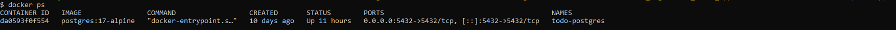

### 2. Tabla `tasks`
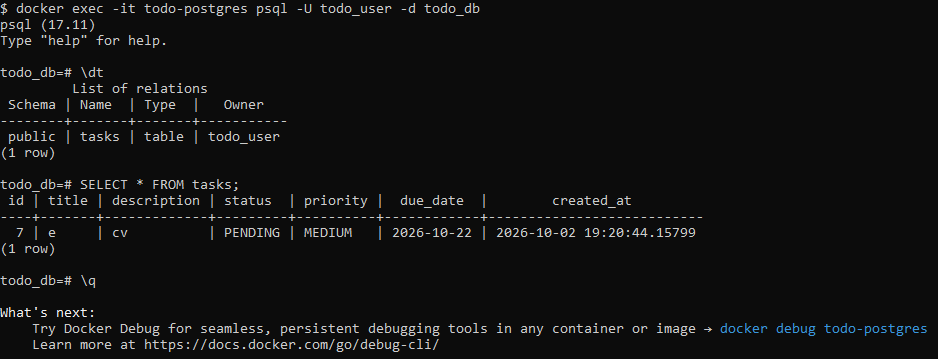

### 3. Pruebas de Service
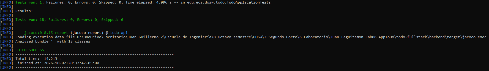

### 4. Pruebas de Controller
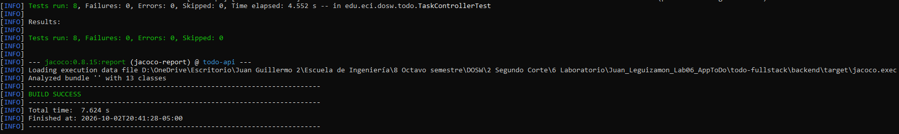

### 5. Reporte JaCoCo
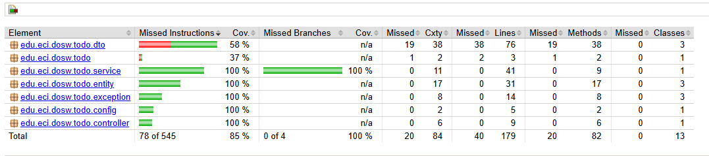

### 6. API funcionando (Postman)
**POST: crear tarea (201)**
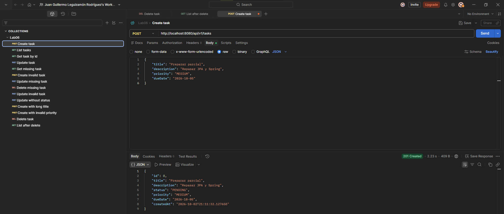

**GET: listar tareas (200)**
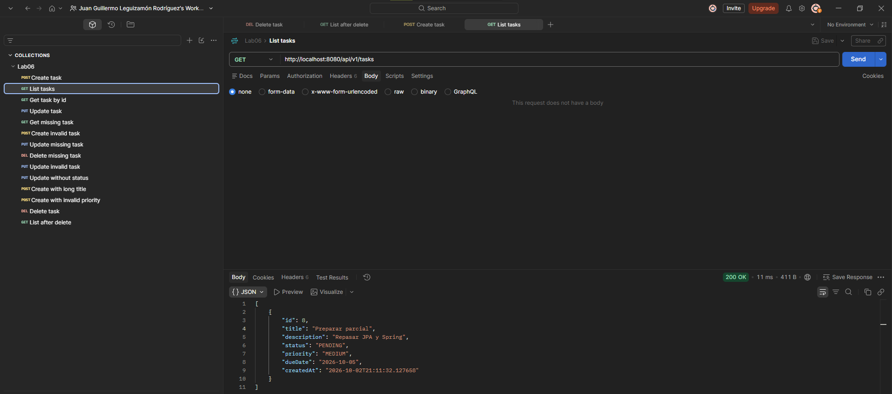

### 7. Aplicación React


### 8. Creación desde React
**Antes de guardar**
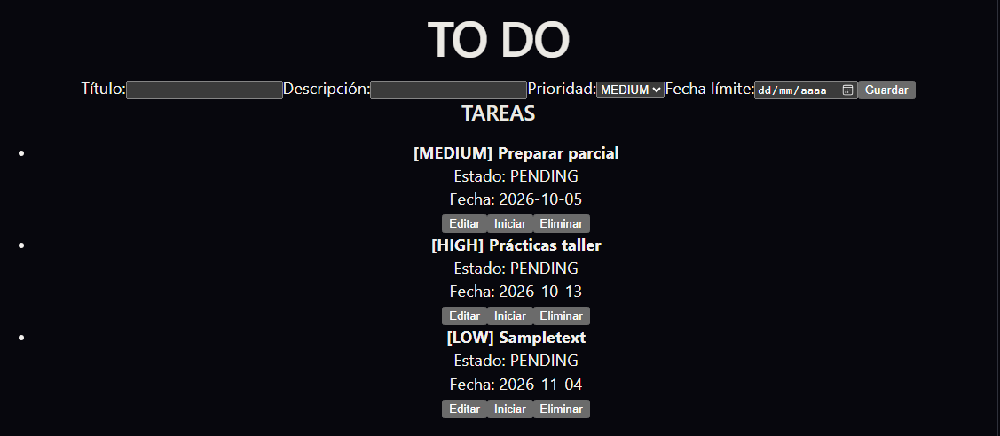

**Después de guardar**
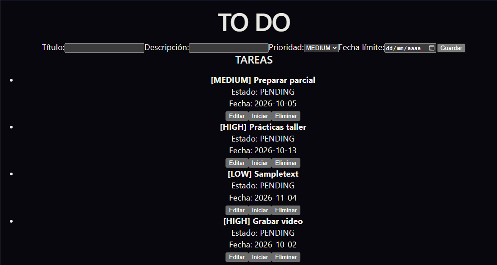

**La tarea guardada en PostgreSQL**


### 9. Edición desde React
**Tarea cargada en el formulario**
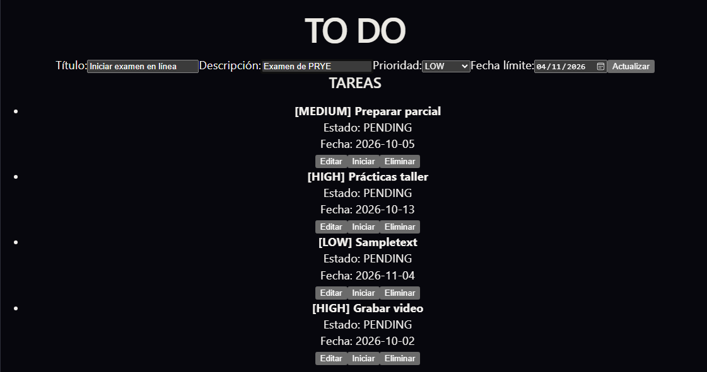

**Lista con el cambio aplicado**
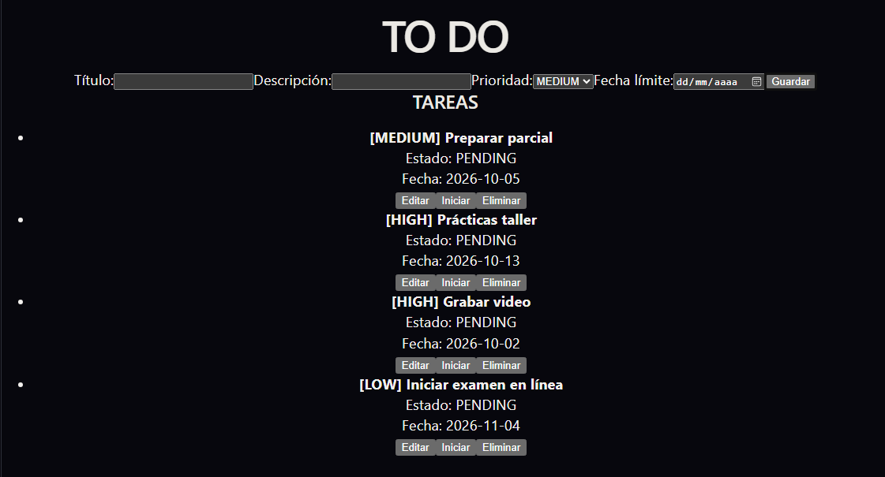

### 10. Eliminación desde React
**Antes de eliminar**
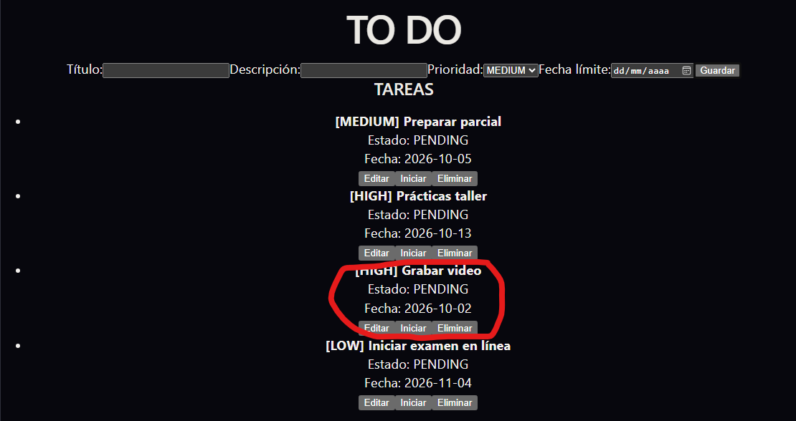

**Después de eliminar**


### 11. Pruebas del Front-end
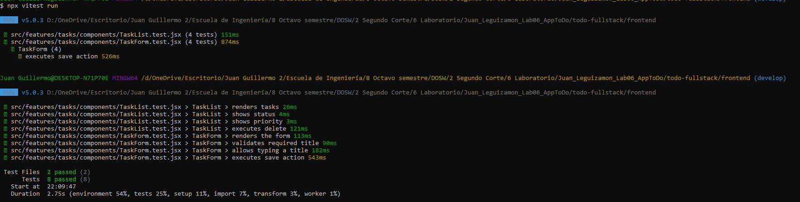

### 12. Vista semanal (bono)
No implementado.

## 6. Resultados de las pruebas

**Back-end** (`mvn clean verify`): 18 pruebas, todas exitosas.

- `TaskServiceTest`: 9 pruebas (los 9 casos mínimos del enunciado), con el `TaskRepository` simulado.
- `TaskControllerTest`: 8 pruebas con MockMvc (los 8 casos mínimos), con el `TaskService` simulado.
- `TodoApplicationTests.contextLoads`: verifica que la aplicación arranque y se conecte a PostgreSQL.

**Cobertura JaCoCo:** [85] % de instrucciones. El `pom.xml` incluye una regla que hace fallar el build si la cobertura baja del 80 %. Los paquetes `service`, `controller`, `entity` y `exception` tienen 100 %.

**Front-end** (`npx vitest run`): 8 pruebas, todas exitosas.

- `TaskForm.test.jsx`: renderiza el formulario, permite escribir un título, ejecuta la acción guardar y valida el título obligatorio.
- `TaskList.test.jsx`: renderiza tareas, muestra el estado, muestra la prioridad y ejecuta eliminar.

**Pendiente:** las pruebas de `TasksPage` (carga de tareas, loading y error con la API simulada).

**Pruebas manuales de la API:** colección de Postman con 14 peticiones, que cubre el CRUD completo y los casos de error (404 para tareas inexistentes y 400 para datos inválidos).

---

## 7. Preguntas de análisis

### Arquitectura

**1. ¿Qué sucede desde que el usuario presiona Guardar tarea hasta que queda almacenada en PostgreSQL?**

Al presionar Guardar, `TaskForm` evita la recarga de la página con `preventDefault`, verifica que el título no esté vacío y llama a `onSave` con los datos del formulario. `TasksPage` recibe ese aviso en `handleSave` y, como no hay una tarea en edición, llama a `addTask` del hook `useTasks`. Este llama a `createTask` de `taskApi.js`, que hace un `fetch` con método POST a `/api/v1/tasks`, enviando la tarea como JSON. En el back-end, `TaskController` recibe la petición, Jackson convierte el JSON en un `TaskCreateRequest` y `@Valid` revisa las validaciones. El `TaskServiceImpl` crea una `TaskEntity`, le asigna los valores por defecto (estado `PENDING`, prioridad `MEDIUM` si no llegó, y la fecha de creación) y la guarda con `TaskRepository.save`. Hibernate traduce eso en un `INSERT` sobre la tabla `tasks`. La respuesta vuelve con código 201 y la tarea creada, y finalmente `useTasks` llama a `loadTasks` para traer la lista actualizada y mostrarla.

**2. ¿Qué responsabilidad tiene cada capa?**

- **Controller:** recibe las peticiones HTTP, valida los datos de entrada con `@Valid`, delega en el Service y define el código de respuesta (201 al crear, 204 al eliminar). No tiene lógica de negocio.
- **Service:** contiene la lógica: asigna los valores por defecto, verifica que la tarea exista (lanzando `TaskNotFoundException` si no), y convierte entre Entity y DTO.
- **Repository:** es el único que accede a la base de datos. Es una interfaz que extiende `JpaRepository`, y Spring genera su implementación.
- **Entity:** representa la tabla `tasks`; cada objeto es una fila.
- **DTO:** define qué datos entran y salen de la API. Por ejemplo, `TaskCreateRequest` no incluye `id` ni `createdAt`, así que el usuario no puede asignarlos; y `TaskResponse` es lo único que ve el cliente.

**3. ¿Por qué el Front-end no se conecta directamente a PostgreSQL?**

Porque las credenciales de la base de datos quedarían expuestas en el navegador de cualquier usuario, y cualquiera podría leer, modificar o borrar datos sin ningún control. La API funciona como intermediario: valida los datos, aplica las reglas de negocio (como el estado inicial `PENDING`) y solo permite las operaciones que expone. Además, el navegador no puede abrir conexiones directas a PostgreSQL; solo se comunica por HTTP.

**4. ¿Qué problema habría si el Controller accediera directamente al Repository e implementara la lógica de negocio?**

El Controller tendría dos responsabilidades mezcladas: atender HTTP y aplicar reglas de negocio. La lógica sería más difícil de probar, porque cada prueba tendría que simular peticiones HTTP, y no se podría reutilizar desde otro punto de entrada. En mi caso, separar el Service permitió probar toda la lógica en `TaskServiceTest` solo con un mock del Repository, y probar el Controller por separado con un mock del Service.

### Persistencia

**5. ¿Cómo se relaciona `TaskEntity` con la tabla `tasks`?**

`TaskEntity` tiene `@Entity` y `@Table(name = "tasks")`, así que cada objeto representa una fila de esa tabla. Cada atributo se mapea a una columna con `@Column`, indicando el nombre cuando difiere del atributo (`dueDate` → `due_date`, `createdAt` → `created_at`). El `id` usa `@Id` y `@GeneratedValue(strategy = GenerationType.IDENTITY)` porque PostgreSQL lo genera con `BIGSERIAL`. Los enums usan `@Enumerated(EnumType.STRING)` porque la tabla guarda el estado y la prioridad como texto (`VARCHAR`), con restricciones `CHECK` que solo aceptan esos valores.

**6. ¿Qué papel cumplen JPA, Hibernate y Spring Data JPA?**

JPA es la especificación: define las anotaciones (`@Entity`, `@Column`, `@Id`...) con las que describí el mapeo. Hibernate es la implementación de JPA que lee esas anotaciones y genera el SQL que se ejecuta en PostgreSQL. Spring Data JPA va un nivel más arriba: con solo declarar la interfaz `TaskRepository extends JpaRepository<TaskEntity, Long>`, genera automáticamente la implementación con las operaciones del CRUD.

**7. ¿Qué operaciones del CRUD proporciona `JpaRepository` sin implementarlas?**

En mi Service usé `save` (crear y actualizar), `findById` (devuelve un `Optional`), `findAll`, `existsById` y `deleteById`. Vienen heredadas de `CrudRepository` a través de `ListCrudRepository`, y no tuve que escribir ninguna.

**8. ¿Por qué se usó `spring.jpa.hibernate.ddl-auto=validate`?**

Porque la estructura de la base de datos la define el script `001_create_schema.sql`, que es la fuente de verdad. Con `validate`, Hibernate no crea ni modifica la tabla; solo verifica al arrancar que la entidad coincida con ella. Así se evita que un cambio en el código altere la base de datos sin control. Lo comprobé en la práctica: con `@Enumerated` sin `EnumType.STRING`, Hibernate esperaba un número en lugar de texto, y la validación lo detecta antes de que la aplicación arranque.

### API REST

**9. Método HTTP de cada operación y por qué es apropiado**

| Operación | Método | Por qué |
|---|---|---|
| Crear | `POST /api/v1/tasks` | Crea un recurso nuevo dentro de la colección; responde 201 Created |
| Consultar | `GET /api/v1/tasks` y `GET /api/v1/tasks/{id}` | Solo lee información, sin modificar nada |
| Actualizar | `PUT /api/v1/tasks/{id}` | Reemplaza los datos de una tarea existente con los que llegan en el cuerpo |
| Eliminar | `DELETE /api/v1/tasks/{id}` | Borra la tarea indicada; responde 204 No Content |

La URL identifica el recurso, y el método indica la acción. Por eso varias operaciones comparten la misma URL.

**10. Diferencia entre los códigos de respuesta**

- **200 OK:** la operación salió bien y la respuesta trae datos (consultar, actualizar).
- **201 Created:** se creó un recurso nuevo; la respuesta trae la tarea creada con su `id`.
- **204 No Content:** salió bien, pero no hay nada que devolver (eliminar).
- **400 Bad Request:** el cliente envió datos inválidos, por ejemplo un título vacío o una prioridad que no existe.
- **404 Not Found:** el recurso solicitado no existe, por ejemplo la tarea 99.
- **500 Internal Server Error:** falló algo en el servidor.

Los 4xx son errores del cliente y los 5xx del servidor. Antes de crear el `GlobalExceptionHandler`, pedir una tarea inexistente respondía 500, porque nadie atrapaba la `TaskNotFoundException`. Con el handler responde 404, como pide la HU-07.

**11. ¿Qué información intercambian React y Spring Boot y en qué formato?**

Se comunican por HTTP con cuerpos en formato JSON. React envía los datos de la tarea al crear (`title`, `description`, `priority`, `dueDate`) y al actualizar (los mismos más `status`). Spring Boot responde con objetos `TaskResponse` (incluyen `id`, `status` y `createdAt`) o, en caso de error, con un `ErrorResponse` con `status` y `message`. En el front-end, `JSON.stringify` convierte los objetos en texto para enviarlos, y `response.json()` convierte las respuestas en objetos de JavaScript.

### React

**12. ¿Qué responsabilidad tiene `taskApi.js`?**

Centraliza toda la comunicación con el back-end. Tiene una función por operación, que arma la petición `fetch` con la URL, el método, las cabeceras y el cuerpo. También revisa si la respuesta fue exitosa y, si no, lanza un `Error` con el mensaje que envió la API. Así, ningún componente necesita conocer URLs ni detalles de HTTP.

**13. ¿Para qué se usó `useState`?**

En `TaskForm`, para los cuatro campos del formulario (inputs controlados) y para el mensaje de error del título obligatorio. En `useTasks`, para la lista de tareas, el indicador `loading` y el mensaje de error de la API. En `TasksPage`, para recordar qué tarea se está editando (`editingTask`).

**14. ¿Para qué se usó `useEffect`?**

En `useTasks`, con un arreglo de dependencias vacío (`[]`), para cargar las tareas automáticamente al abrir la página. En `TaskForm`, con `[task]`, para llenar los campos del formulario cada vez que se selecciona una tarea para editar.

**15. ¿Cómo se actualiza la pantalla después de crear, editar o eliminar?**

Cada acción del hook (`addTask`, `editTask`, `removeTask`) llama primero a la función correspondiente de `taskApi.js`, y cuando la API responde, llama a `loadTasks`. Esa función trae la lista actualizada desde el back-end y la guarda con `setTasks`. Como el estado cambió, React vuelve a dibujar `TaskList` con la nueva información, sin recargar la página.

### Docker y PostgreSQL

**16. Ventaja de usar la imagen oficial de PostgreSQL en Docker**

No fue necesario instalar ni configurar PostgreSQL en el equipo. Con un solo comando se tiene la misma versión (17-alpine) en cualquier computador, y el contenedor se puede detener, iniciar o recrear fácilmente sin afectar el sistema. Esto me sirvió al trabajar en dos computadores distintos.

**17. Diferencia entre los comandos de Docker**

- `docker pull`: descarga la imagen desde Docker Hub.
- `docker run`: crea un contenedor nuevo a partir de la imagen y lo inicia.
- `docker stop`: detiene un contenedor que está corriendo, sin borrarlo.
- `docker start`: vuelve a iniciar un contenedor que ya existía.
- `docker exec`: ejecuta un comando dentro de un contenedor en marcha; lo usé para entrar a `psql` y ejecutar el script SQL.

**18. ¿Por qué se usó un volumen?**

Para que los datos de PostgreSQL se guarden fuera del contenedor. Así, aunque el contenedor se detenga, se elimine o se recree, la información se conserva.

**19. ¿Qué pasa si se elimina el contenedor pero se conserva el volumen?**

Los datos se mantienen. Al crear un contenedor nuevo que use el mismo volumen, las tablas y las tareas vuelven a estar disponibles. Durante el laboratorio eliminé tanto el contenedor como el volumen, y en ese caso sí se perdió todo: tuve que crear de nuevo el contenedor y ejecutar otra vez el script de la tabla.

### Pruebas

**20. ¿Por qué las pruebas del Service no deben depender de PostgreSQL?**

Porque una prueba unitaria debe verificar solo la lógica del Service. Si dependiera de la base de datos, un fallo podría deberse a Docker, a la conexión o a los datos existentes, y no al código. Además, con un mock las pruebas son más rápidas, permiten simular cualquier escenario (como una tarea inexistente con `Optional.empty()`) y funcionan aunque PostgreSQL esté apagado.

**21. ¿Qué dependencia se simuló al probar `TaskService` y por qué?**

El `TaskRepository`, con Mockito (`@Mock`), inyectado en `TaskServiceImpl` con `@InjectMocks`. Se programaron sus respuestas con `when(...).thenReturn(...)` y `thenAnswer(...)` (para simular que `save` asigna el `id`), y se verificaron las llamadas con `verify`, por ejemplo que `deleteById` nunca se llame si la tarea no existe.

**22. ¿Qué dependencia se simuló al probar `TaskController`?**

El `TaskService`, con `@MockitoBean`. Con `@WebMvcTest` solo se carga la capa web (el Controller, las validaciones y el `GlobalExceptionHandler`), y con MockMvc se simulan las peticiones HTTP para verificar los códigos de respuesta y el JSON devuelto.

**23. Un error detectado por una prueba y cómo se corrigió**

En la prueba `update_shouldUpdateExistingTask`, la primera versión verificaba los valores del **request** que yo mismo había creado, en lugar de la **respuesta** del Service. Por eso pasaba siempre, aunque el método `update` no hiciera nada. Lo corregí guardando el `TaskResponse` que devuelve `service.update(...)` y verificando sus campos (título, estado y prioridad nuevos, y el mismo `id`). Otro caso: al mover la creación de la tarea de prueba a un `@BeforeEach`, la prueba `findById_shouldReturnTaskWhenExists` empezó a fallar con `TaskNotFoundException`, porque al reorganizar el código se perdió la programación del mock de `findById`.

**24. ¿Qué información proporciona JaCoCo y por qué un porcentaje alto no garantiza buenas pruebas?**

JaCoCo mide qué líneas, instrucciones y ramas del código se ejecutaron durante las pruebas. En mi proyecto, los paquetes `service`, `controller`, `entity` y `exception` llegaron al 100 %. Pero la cobertura solo dice que el código se ejecutó, no que se haya verificado algo. Por ejemplo, la primera versión de la prueba de `update` ejecutaba todo el método (contaba como cubierto) sin verificar el resultado. Y al revés: los setters de los DTO aparecen sin cubrir y bajan el porcentaje, aunque no representan ningún riesgo real.

### Integración

**25. Flujo completo y cómo se comunican las partes**

```
React (TaskForm / TaskList)
   ↓ eventos del usuario (onSave, onDelete, onEdit...)
useTasks → taskApi.js (fetch)
   ↓ HTTP + JSON
TaskController
   ↓ DTO validado
TaskService
   ↓ TaskEntity
TaskRepository
   ↓
JPA / Hibernate (genera SQL)
   ↓
PostgreSQL (en Docker)
```

El usuario interactúa con los componentes de React, que no conocen la API: solo avisan qué quiere hacer el usuario. `TasksPage` conecta esos avisos con las acciones de `useTasks`, que usa `taskApi.js` para hacer las peticiones HTTP con JSON. En el back-end, el Controller recibe la petición y delega en el Service, que aplica la lógica y usa el Repository. Hibernate traduce las operaciones del Repository a SQL sobre PostgreSQL, que corre en Docker. La respuesta recorre el camino inverso: la entidad se convierte en DTO, se envía como JSON, y React actualiza el estado para mostrar el resultado.

---

## 8. Video de demostración

[Ver video de demostración en YouTube](https://youtu.be/unN0p0413Vk)
